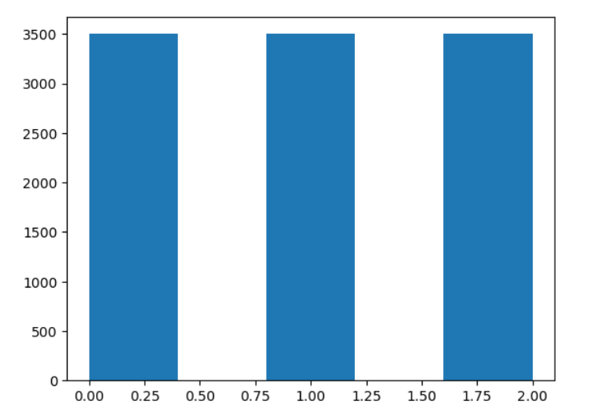
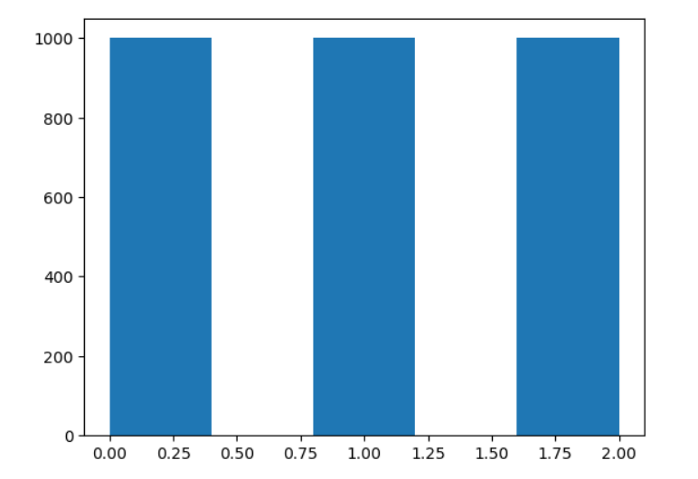

# Documentație Proiect IA

Nume: **Voinescu David-Ioan**

Grupa: **241**

## Descrierea datelor
Setul de antrenare este compus din **10500** de imagini

Setul de antrenare este compus din **3000** de imagini

Setul de antrenare este compus din **4500** de imagini

Fiecare imagine este de **80x80** si color -> **80x80x3**




Observam ca sunt distribuite perfect egal toate clasele.

## Descrierea abordărilor:

Pentru dataset-ul primit, am folosit 2 tipuri de modele principale, dar de asemenea am incercat si alte abordari naive:

#### Modele Naive 
  - un model clasic K-NN cu o acuratete maxima de ***0.42*** pe datele de validare
  - un model clasic DecisionTress cu o acuratete maxima de ***0.404*** pe datele de validare
  - un model clasic MultinomialNaiveBayes cu o acuratete maxima de ***0.418*** pe datele de validare
  - un model clasic RandomForest cu o acuratete maxima de ***0.525*** pe datele de validare 
  - un model clasic SVC cu o acuratete maxima de ***0.538*** pe datele de validare si ***0.55*** pe datele de test

**clasic = cu hyperparametri default*
#### Modele Principale
  - un model NN cu o acuratete maxima de ***0.533*** pe datele de validare
  - un model CNN cu o acuratete maxima de ***0.702*** pe datele de validare si ***0.712*** pe datele de test
  - un model CNN cu o acuratețe maxima de ***0.735*** pe datele de validare si ***0.752*** de datele de test (submisia finala).


## Model NN (Neural Network)

### Preprocesarea datelor

Intai am normalizat valori pixelilor impartindu-i la 255, iar apoi pentru fiecare canal de culoare separat am calculat media si deviatia standard:
|              | R       | G       | B       |
|--------------|---------|---------|---------|
| **Medie**    | 0.4257  | 0.4727  | 0.4986  |
| **Deviatie** | 0.2739  | 0.2547  | 0.2609  |


```
def calcul_medie_deviatie(imagini):
    suma_canale, suma_canale_squared = 0, 0
    for imagine in imagini:
        suma_canale += torch.mean(imagine, axis=[1,2])
        suma_canale_squared += torch.mean(imagine**2, axis=[1,2])
        
    medie = suma_canale / len(imagini)
    deviatie  = (suma_canale_squared / len(imagini) - medie**2) ** 0.5
    return medie, deviatie
```

```
medie, deviatie = calcul_medie_deviatie(X_train)
print(medie, deviatie) 
# tensor([0.4257, 0.4727, 0.4986]) tensor([0.2739, 0.2547, 0.2609])
```

```
X_train = X_train / 255
X_val = X_val / 255
X_test = X_test / 255
transforms.Normalize(mean=[0.4257, 0.4727, 0.4986], std=[0.2739, 0.2547, 0.2609])
```

Apoi am transformat fiecare imagine intr-un vector 1d pentru a fi putea fi introdus in input-ul nn-ului (**80x80x3**) -> (**1,19200**).

```
X_train = torch.as_tensor(np.array(X_train), dtype=torch.float32).reshape(-1, 19200)
X_val = torch.as_tensor(np.array(X_val), dtype=torch.float32).reshape(-1, 19200)
X_test = torch.as_tensor(np.array(X_test), dtype=torch.float32).reshape(-1, 19200)
```

### Parametri si constructia modelului
| Nr. Layer        | Tip                | Marime input     | Marime output    | Functie de activare        |
|------------------|--------------------|------------------|------------------|----------------------------|
| 1                | Fully Connected    | 19200            | 1920             | ReLU + BatchNorm + Dropout |
| 2                | Fully Connected    | 1920             | 1280             | ReLU + BatchNorm + Dropout |
| 3                | Fully Connected    | 1280             | 640              | ReLU + BatchNorm + Dropout |
| 4                | Fully Connected    | 640              | 480              | ReLU + BatchNorm + Dropout |
| 5                | Fully Connected    | 480              | 320              | ReLU + BatchNorm + Dropout |
| 6                | Fully Connected    | 320              | 160              | ReLU + BatchNorm + Dropout |
| Output Layer     | Fully Connected    | 160              | 3                |              -             |


### Matrice de confuzie


### Acuratete in functie de hyperparametri
- Pentru Optimizator am folosit Adam
- Pentru Functia de loss am folosit CrossEntropyLoss
- Am folosit batch_size de 64 si 32, dar diferentele erau infime


### Functia de loss raportata la numarul de epoci (dropout = 0.5)


### Acuratete dupa numarul de epoci (dropout = 0.5)


- Este evident ca modelul face overfit, cu toate ca dupa fiecare layer am folosit un dropout de **0.5**, asa ca mai departe am incercat un dropout mai mare de **0.7**

### Acuratete dupa numarul de epoci (dropout = 0.7)


- Din nou face overfit, doar ca mai incet. Am incercat si cu dropout = **0.8**, iar modelul din nou face overfit, doar ca mult mai incet.

### Acuratete dupa numarul de epoci (dropout = 0.9)


- Acum face intr-un final underfit ajungand la maxim **38.5%.**

## Model CNN

### Utilitatea modelului
Modele CNN (Convolutional Neural Networks) sunt cele mai puternice si folosite modele din domeniul de Computer Vision.
Acestea sunt folosite deoarece in general sunt mai putin costisitoare si mai rapide decat clasicele NN (Neural Networks) si pentru ca ele folosesc anumite straturi care le permit sa observe o multime pattern-uri in imagine.

### Layere folosite
1. **Conv2D** - Creează un kernel de convoluție care aplică filtre asupra inputului pentru a genera o matrice de feature-uri.
2. **BatchNormalization** - Normalizeaza output-urile primite si le transforma astfel incat sa aiba media 0 si deviatia 1, apoi trimitandu-le mai departe
3. **MaxPool2D** - Reduce dimensiunile input-ului prin retinerea maximimului pe o anumita bucata formata din mai multi neuroni
4. **Dropout** - Are rolul de a reduce overfitt-ul prin dezactivarea unor neuroni random, astfel fortand modelul sa gaseasca parametrii cat mai buni, folosind un numar signifcant mai mic de neuroni
5. **Flatten** - Aplatizeaza input-ul intr-o singura dimensiune (pentru a putea fi dat mai departe spre mini reteaua neuronala)
6. **Dense** - un fully conected layer exact ca la un NN
### Preprocesarea datelor

Intai am normalizat valori pixelilor impartindu-i la **255**, iar apoi pentru fiecare canal de culoare separat am calculat media si deviatia standard:
|              | R       | G       | B       |
|--------------|---------|---------|---------|
| **Medie**    | 0.4257  | 0.4727  | 0.4986  |
| **Deviatie** | 0.2739  | 0.2547  | 0.2609  |

De asemenea pentru a preveni overfitt-ul (a diversifica datele de antrenare) am rotit si invartit imaginile cu probabilitatea default de **0.5** pentru flip si **+- 10** grade pentru rotire:
```    
transforms.RandomHorizontalFlip(),
transforms.RandomRotation(10),
```

### Parametri si constructia modelului ( De tradus si schimbat)
Intai am folosit un CNN simplu, la care am mai adaugat si scos layere, dar acesta a fost rezultatul in forma lui finala:

| Nr. Layer        | Tip                | Marime input     | Marime output    | Functie de activare   |
|------------------|--------------------|------------------|------------------|--------------|
| 1                | Conv2d + BN + ReLU | (Batch, 3, H, W) | (Batch, 64, H, W)| ReLU         |
| 2                | MaxPool2d          | (Batch, 64, H, W)| (Batch, 64, H/2, W/2) | -          |
| 3                | Conv2d + BN + ReLU | (Batch, 64, H/2, W/2) | (Batch, 64, H/2, W/2) | ReLU   |
| 4                | MaxPool2d          | (Batch, 64, H/2, W/2) | (Batch, 64, H/4, W/4) | -     |
| 5                | Conv2d + BN + ReLU | (Batch, 64, H/4, W/4) | (Batch, 128, H/4, W/4) | ReLU  |
| 6                | MaxPool2d          | (Batch, 128, H/4, W/4) | (Batch, 128, H/8, W/8) | -    |
| 7                | Conv2d + BN + ReLU | (Batch, 128, H/8, W/8) | (Batch, 256, H/8, W/8) | ReLU |
| 8                | MaxPool2d          | (Batch, 256, H/8, W/8) | (Batch, 256, H/16, W/16) | -   |
| 9                | Conv2d + BN + ReLU | (Batch, 256, H/16, W/16) | (Batch, 256, H/16, W/16) | ReLU |
| 10               | MaxPool2d          | (Batch, 256, H/16, W/16) | (Batch, 256, H/32, W/32) | -   |
| 11               | Flatten            | (Batch, 256, H/32, W/32) | (Batch, 256xH/32xW/32) | -    |
| 12               | Fully Connected    | (Batch, 256xH/32xW/32) | (Batch, 1024) | ReLU + Dropout(0.5) |
| 13               | Fully Connected    | (Batch, 1024) | (Batch, 512) | ReLU + Dropout(0.5) |
| Output Layer     | Fully Connected    | (Batch, 512) | (Batch, 3) | - |

**Batch = 64*

**H = W = 80*
### Matrice de confuzie


- Observam ca cea mai mare problema a modelului sunt imaginile cu **label 2** clasificate avand **label 1**

### Acuratete in functie de hyperparametri
- Pentru Optimizator am folosit Adam
- Pentru Functia de loss am folosit CrossEntropyLoss
- Am folosit batch_size de **64**
- Pentru functia de activare am folosit ReLu, am incercat si Sigmoid si TanH, dar erau mai slabe


**lr = learning rate pt Adam*

**do = dropout rate*

- Cea mai buna acuratete a ramas cea cu dropout = ***0.5*** si lr = ***0.001***

### Functia de loss raportata la numarul de epoci


### Acuratete dupa numarul de epoci


Acesta se plafona in zona de ***0.68***, pe care o atingea dupa aproximativ **10-12** epoci, indiferent de adaugarea altor straturi si de schimbarea parametrilor am observat ca aceasta este zona unde se plafoneaza. Astfel am apelat la tehnici mai avansate (din cartea lui Aurelien Geron "Hands-On-Machine-Learning-with-Scikit-Learn-Keras-and-Tensorflow").

1. Folosirea ***Inception Modules***. Ce sunt si ce fac ele?
- Sunt configurate pentru a scoate mai puține hărți de caracteristici decât intrările lor, deci ele servesc ca straturi de blocaj, ceea ce înseamnă că reduc dimensionalitatea. Acest lucru taie costul de calcul și numărul de parametri, accelerând antrenamentul și îmbunătățirea generalizării. Mai jos este o poza care reprezinta in mare cum arata un inception module.

- Layeurile de 1x1 sunt folosite pentru a putea schimba numarul de canale, si de asemenea ele se focuseaza pe legatura dintre mape, decat pe mape in sine

2. Folosirea ***Skip Connections***. Ce sunt si ce fac ele?
- Output unui start este, de asemenea adăugat si la ieșirea unui alt strat situat mai sus.


3. Folosire ***Residual Blocks*** Ce sunt si ce fac ele?
- Practic reprezinta un mini CNN, in care sunt folosite ***skip connections***. Sunt utile deoarece, rețeaua poate începe să facă progrese chiar dacă mai multe straturi nu au început încă să învețe.


4. Folosirea ***SE Blocks*** (Squeeze and Excitation Network) Ce sunt si ce fac ele?
- Un bloc SE analizează ieșirea output-ului unui bloc la care este atasat, concentrându-se exclusiv pe adâncime, adica nu cauta pattern-uri intr-o mapa ci pattern-uri intre mape și învață care mape sunt de obicei cele mai active împreună. Apoi folosește aceste informații pentru a recalibra weights-urile lor.
Este folosit de obicei inauntrul ***Residual Blocks*** si ***Inception Modules***


Astfel asa arata noul model care foloseste aceste tehnici:

ResidualBlockWithSE
| Nr. Layer        | Tip                               | Marime input           | Marime output         | Functie de activare       |
|------------------|-----------------------------------|------------------------|-----------------------|---------------------------|
| 1                | Conv2d (3x3) + BN + ReLU          | (Batch, 256, H/4, W/4) | (Batch, 256, H/4, W/4)| ReLU                      |
| 2                | Conv2d (3x3) + BN                 | (Batch, 256, H/4, W/4) | (Batch, 256, H/4, W/4)| -                         |
| 3                | SE Block                          | (Batch, 256, H/4, W/4) | (Batch, 256, H/4, W/4)| -                         |
| 4                | Shortcut Connection (Identity)    | (Batch, 256, H/4, W/4) | (Batch, 256, H/4, W/4)| -                         |
| 5                | Addition and ReLU                 | (Batch, 256, H/4, W/4) | (Batch, 256, H/4, W/4)| ReLU                      |

InceptionModuleWithSE
| Nr. Layer        | Tip                               | Marime input           | Marime output         | Functie de activare       |
|------------------|-----------------------------------|------------------------|-----------------------|---------------------------|
| 1                | Conv2d (1x1) + BN + ReLU (Branch 1) | (Batch, 32, H/2, W/2) | (Batch, 32, H/2, W/2)| ReLU                      |
| 2                | Conv2d (1x1) + BN + ReLU (Branch 2) | (Batch, 32, H/2, W/2) | (Batch, 32, H/2, W/2)| ReLU                      |
| 3                | Conv2d (3x3) + BN + ReLU (Branch 2) | (Batch, 32, H/2, W/2) | (Batch, 32, H/2, W/2)| ReLU                      |
| 4                | Conv2d (1x1) + BN + ReLU (Branch 3) | (Batch, 32, H/2, W/2) | (Batch, 32, H/2, W/2)| ReLU                      |
| 5                | Conv2d (5x5) + BN + ReLU (Branch 3) | (Batch, 32, H/2, W/2) | (Batch, 32, H/2, W/2)| ReLU                      |
| 6                | MaxPool2d + Conv2d (1x1) + BN + ReLU (Branch 4) | (Batch, 32, H/2, W/2) | (Batch, 32, H/2, W/2)| ReLU          |
| 7                | Concatenate                        | (Batch, 32, H/2, W/2) x 4 | (Batch, 128, H/2, W/2) |          -           |
| 8                | SE Block                           | (Batch, 128, H/2, W/2) | (Batch, 128, H/2, W/2)|              -           |

Model
| Nr. Layer        | Tip                               | Marime input           | Marime output         | Functie de activare       |
|------------------|-----------------------------------|------------------------|-----------------------|---------------------------|
| 1                | Conv2d + BN + ReLU                | (Batch, 3, H, W)       | (Batch, 32, H, W)     | ReLU                      |
| 2                | MaxPool2d                         | (Batch, 32, H, W)      | (Batch, 32, H/2, W/2) | -                         |
| 3                | InceptionModuleWithSE (Inception1)| (Batch, 32, H/2, W/2)  | (Batch, 128, H/2, W/2)| ReLU                      |
| 4                | MaxPool2d                         | (Batch, 128, H/2, W/2) | (Batch, 128, H/4, W/4)| -                         |
| 5                | InceptionModuleWithSE (Inception2)| (Batch, 128, H/4, W/4) | (Batch, 256, H/4, W/4)| ReLU                      |
| 6                | ResidualBlockWithSE (Residual1)   | (Batch, 256, H/4, W/4) | (Batch, 256, H/4, W/4)| ReLU                      |
| 7                | MaxPool2d                         | (Batch, 256, H/4, W/4) | (Batch, 256, H/8, W/8)| -                         |
| 8                | ResidualBlockWithSE (Residual2)   | (Batch, 256, H/8, W/8) | (Batch, 256, H/8, W/8)| ReLU                      |
| 9                | Conv2d + BN + ReLU                | (Batch, 256, H/8, W/8) | (Batch, 64, H/8, W/8) | ReLU                      |
| 10               | MaxPool2d                         | (Batch, 64, H/8, W/8)  | (Batch, 64, H/16, W/16)| -                        |
| 11               | Global Avg Pool                   | (Batch, 64, H/16, W/16)| (Batch, 64, 1, 1)     | -                         |
| 12               | Flatten                           | (Batch, 64, 1, 1)      | (Batch, 64)           | -                         |
| 13               | Fully Connected (FC1)             | (Batch, 64)            | (Batch, 128)          | ReLU + Dropout(0.5)       |
| 14               | Fully Connected (FC2)             | (Batch, 128)           | (Batch, 256)          | ReLU + Dropout(0.5)       |
| Output Layer     | Fully Connected                   | (Batch, 256)           | (Batch, 3)            | -                         |

### Matrice de confuzie


- Observam ca din nou cea mai mare problema este prezicerea clasei cu **label 2** ca fiind **1**, doar ca acum aceasta confuzie a scazut, in timp ce se observa ca a crescut cea complementara, adica prezicerea imaginii  cu label 2, care are de fapt label corect 1

### Acuratete in functie de hyperparametri
- Aici am incercat doar lr de **0.001** si **0.01** care sunt similare ca si rezultat, iar ca dropout am incercat de **0.5** si **0.2**, iar pentru **0.2** modelul nu scotea mai mult de **40%** acuratete si incepea sa faca overfit, pe cand pentru dropout **0.5** modelul invata constant fara a face overfit, mai jos sunt grafice pentru loss si acuratete cand modelul foloseste **0.5** la dropout si lr = **0.001**. De asemenea, as fi dorit sa incerc mai multe dropout-uri cum ar fi **0.4** si **0.6**, doar ca fiecare epoca dura foarte mult si nu am avut timp sa testez pe mai multi hyperparametri.

### Functia de loss raportata la numarul de epoci


### Acuratete in functie de numarul de epoci


- Observam ca de la epoca **15** incolo progresul pare sa fie aproape 0, singurul plus pentru continuarea rularii urmatoarelor epoci fiind stabilizarea modelului. Modelul se plafoneaza undeva la ***73%*** acuratete. Am schimbat learning rate-ul la **0.01** sau la **0.1** dupa ce modelul a ajuns aici, dar acesta nu a facut niciun progres, din contra a inceput sa scada.

## Referinte
Carte ML: https://powerunit-ju.com/wp-content/uploads/2021/04/Aurelien-Geron-Hands-On-Machine-Learning-with-Scikit-Learn-Keras-and-Tensorflow_-Concepts-Tools-and-Techniques-to-Build-Intelligent-Systems-OReilly-Media-2019.pdf

Curs Cnn: https://youtu.be/2xqkSUhmmXU?list=PLtBw6njQRU-rwp5__7C0oIVt26ZgjG9NI

